# User Guide

> IMPORTANT NOTE: The collection tracker is only as good as your commitment to using it. Failure to do this means your tracked collection will get out of sync with reality.

## What is this?

`mtg-collection-tracker` is a cross-platform application for managing your Magic: The Gathering card collection. It keeps track of:

- The cards you own (including proxies, foil/condition, language and edition)
- Where your cards live (loose in the collection, in containers, or assigned to decks)
- The cards you want (your **wishlist**), with vendor price offers and in-transit tracking
- Your **decks**, including which cards are in them and whether you can build a new decklist from what you own
- Your collection's **price history**, powered by MTGJSON price data (linked to your cards via Scryfall)
- **Playtesting** a deck in a simulated game, with zones, counters and turn tracking

All data is stored in a local SQLite database (`collection.sqlite`) by default.

---

## Getting started

### Installing

Download the installer or binary for your platform from the [releases page](https://github.com/jumpinjackie/mtg-collection-tracker/releases):

- **Windows** — Windows binary
- **Linux** — Linux binary or AppImage
- **macOS** — macOS binary

Install/run it like any other application for your platform, then launch it. Building from source is only necessary for developers; see the README if you need to do that.

### First launch

The first time you launch the app with an empty database, you will be prompted to **Import Card Identifiers**. This downloads the Scryfall card identifier mapping that links your cards to their Scryfall images and metadata, and to MTGJSON price data. Click **Begin** and wait for the download to finish.

> **Keep it up to date.** Run **Import Card Identifiers** again (from **Settings → Database Maintenance**) whenever a new Magic set is released. This adds the new set's cards to the app's identifier mapping, so you can start adding those cards and tracking their prices as soon as they become available.
>
> **Note on upcoming sets.** You don't need to import card identifiers to add cards from upcoming sets to your **wishlist**. As long as Scryfall already knows about those cards, you can add them to your wishlist right away.

### Choosing a mode at startup

Each time the app starts you are asked to pick a mode:

| Mode | What it does |
|------|--------------|
| **Local** | Uses the collection database on this machine. The default for a single-machine setup. |
| **Server** | Starts an embedded sharing server so other devices on your network can connect to this machine's collection database. |
| **Remote Client** | Connects to a remote instance running in Server mode. All operations are forwarded to that server. |

The last-used mode and connection settings are remembered for next time.

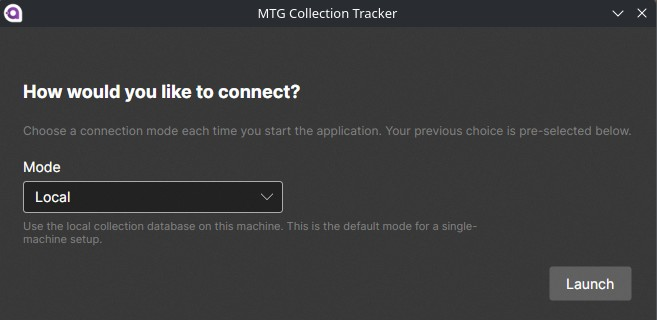
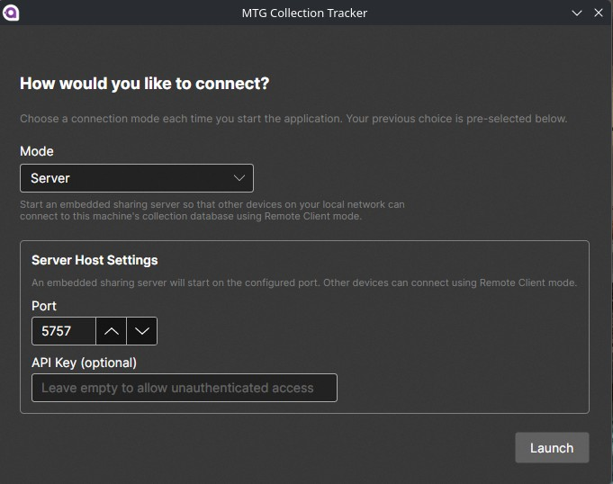
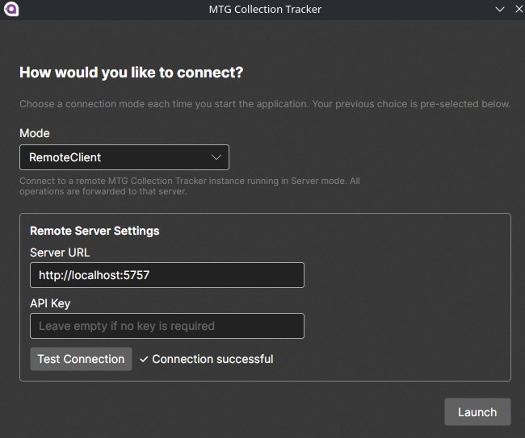

---

## The main window

The main window is organised into eight tabs:

1. **Cards** — your collection
2. **Containers** — boxes/binders that hold cards
3. **Decks** — your built decks
4. **Wishlist** — cards you want to buy
5. **Can I Build?** — check a decklist against your collection
6. **Notes** — free-form notes
7. **Playtesting** — simulate a game with a deck
8. **Settings** — tags and database maintenance

When running in Server or Remote Client mode, a status bar is shown along the bottom of the window.

---

## Cards (your collection)

The Cards tab is where you browse and manage everything you own. A summary line at the bottom shows the totals, for example: `1200 cards (45 proxies) across 320 skus`.

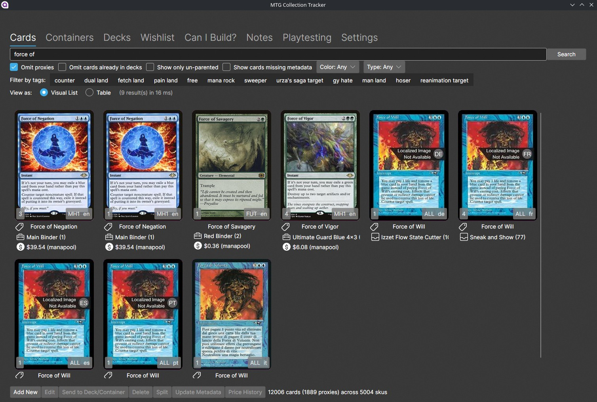

### Searching and filtering

Type a card name into the search box and press **Search**. You can combine the search with:

- **Tags** — filter by the tags assigned to your cards
- **Color** — White, Blue, Black, Red, Green or Colorless (multi-select)
- **Card type** — Artifact, Creature, Enchantment, Instant, Sorcery, Land, Planeswalker, etc.
- **No proxies** — exclude proxy copies from results
- **Not in decks** — only cards not currently assigned to a deck
- **Unparented** — only cards not assigned to any container or deck
- **Missing metadata** — cards that have not yet been matched to Scryfall metadata

The results list can be displayed as a **Visual List** or a **Table** using the view-mode buttons.

### Working with cards

Select one or more cards and use the toolbar buttons:

| Action | Description |
|--------|-------------|
| **Add New** | Add new cards to your collection, either one by one or by importing a CSV file. |
| **View Details** | *(coming soon)* |
| **Edit** | Edit the selected card SKU (edition, language, foil, condition, quantity, comments, tags…). Select several SKUs to edit them in bulk. |
| **Send to Deck/Container** | Move the selected cards into a deck or container. |
| **Delete** | Remove the selected cards from your collection. |
| **Split** | Split a SKU that has multiple copies into two SKUs (e.g. to move part of a playset elsewhere). |
| **Update Metadata** | Re-resolve the selected cards' metadata from Scryfall. |
| **Price History** | Show the price history chart for the selected card. |

### Adding cards

**Add New** opens the *Add Cards* dialog. You can:

- Add individual rows of cards by name and edition, with foil, land, sideboard, condition and comments fields
- **Import** a CSV file of cards in bulk

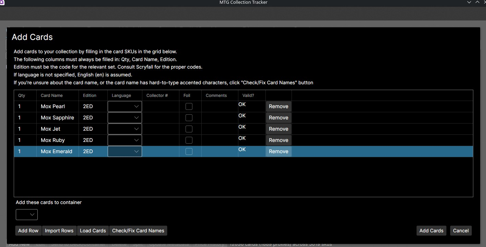

You can also turn the current search term directly into a wishlist item (useful when you find a card you want but don't yet own).

### Price history

Select a single card and click **Price History** to see its price over time. Price data comes from MTGJSON; Scryfall provides the card images and metadata that the prices are linked to.

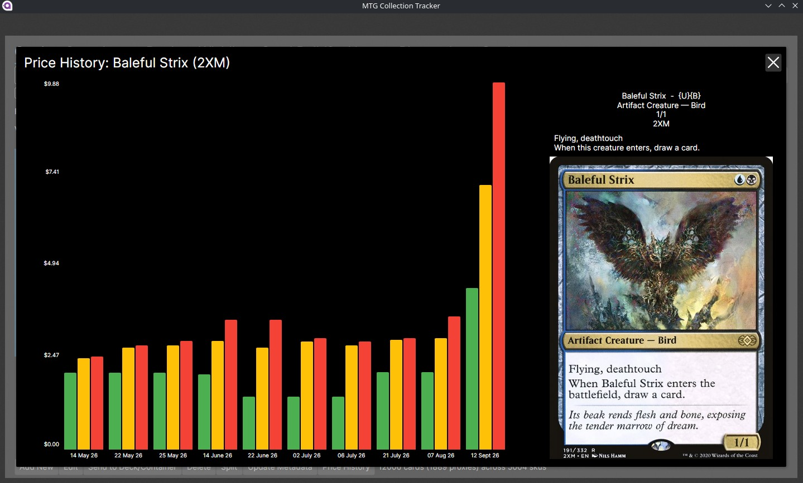

---

## Containers

Containers represent the physical places you store cards — binders, deck boxes, bulk boxes, etc. The Containers tab lists them and lets you **Add New**, **View Container**, **View Container (as text)**, **Edit** and **Delete**.

- **View Container** opens the container in the same card list interface as the Cards tab, so you can add, edit, split and send the cards inside it.
- **View Container (as text)** produces a plain-text list of the container's contents that you can print or paste elsewhere.

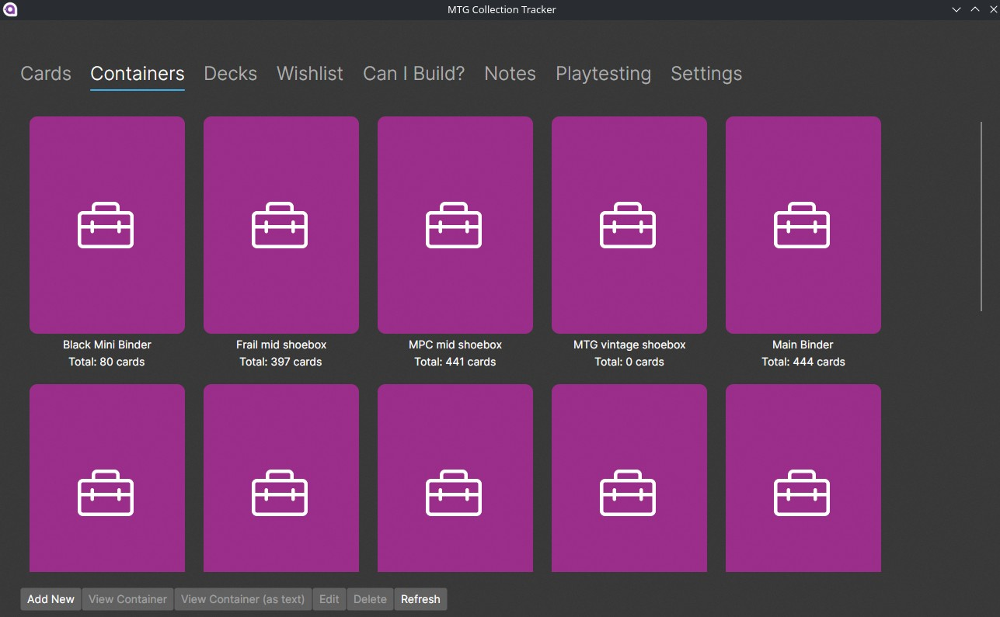
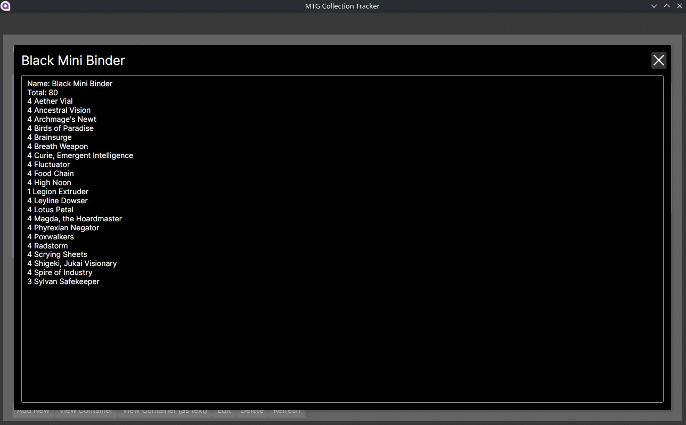

---

## Decks

The Decks tab lists your decks and lets you filter them by format. From here you can **Add New**, **View Deck**, **Edit**, **Dismantle**, **Check Legality** *(coming soon)*, run a **Lowest Price Check**, or **Refresh**.

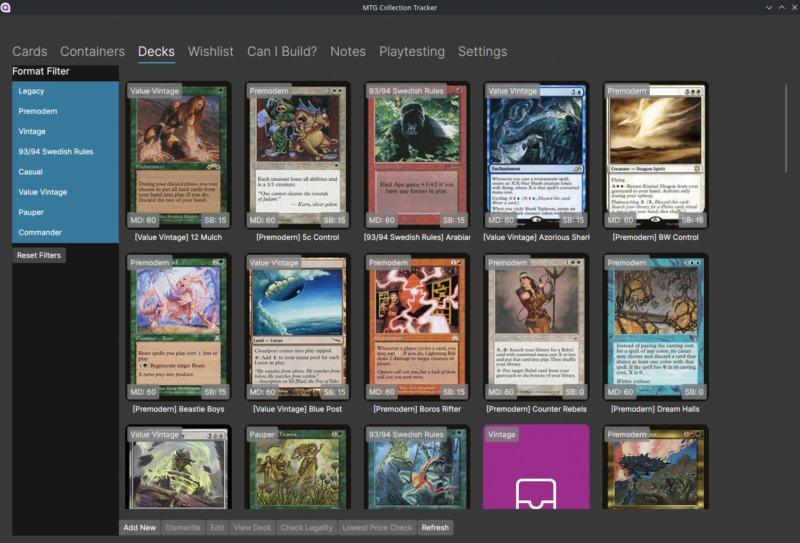

### Viewing a deck

**View Deck** opens the deck details dialog. You can switch between several views:

- **Text** — a plain decklist
- **Visual (by SKU)** / **Visual (by Card Name)** — card images
- **Table (by SKU)** / **Table (by Card Name)** — a table listing

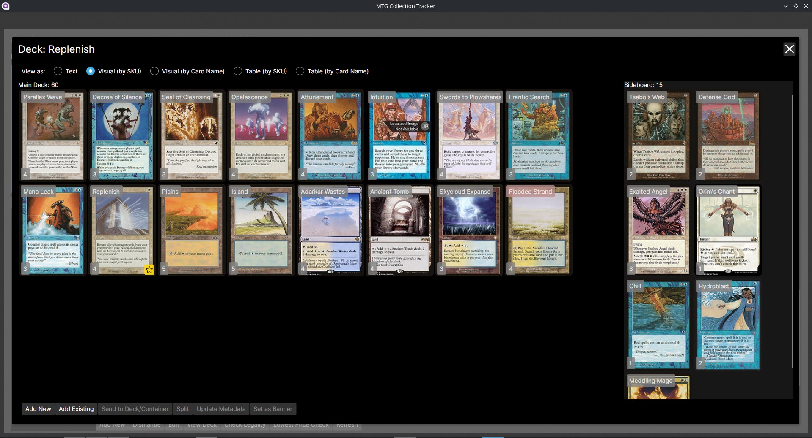

From deck details you can:

- **Add New** — add new cards straight into the deck (creating them in your collection at the same time)
- **Add Existing** — add cards you already own
- **Send to Deck/Container** — move cards from the deck elsewhere
- **Split** — split a SKU inside the deck
- **Update Metadata** — refresh Scryfall metadata
- **Set as banner** — choose a card to display as the deck's banner (e.g. the commander)

---

## Wishlist

The Wishlist tab tracks the cards you want to acquire, independently of your physical collection. Each wishlist item has a desired quantity, edition and language, and can carry **vendor price offers** and **tags**.

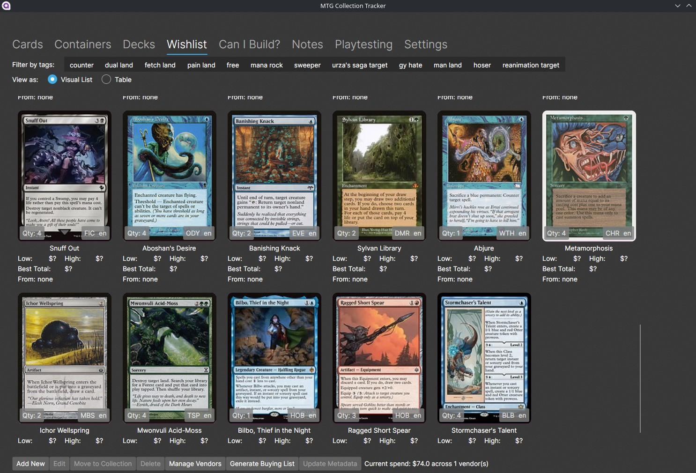

Actions:

| Action | Description |
|--------|-------------|
| **Add New** | Add cards to your wishlist (with CSV import support). |
| **Edit** | Change an item's quantity, edition, language, tags, vendor offers and in-transit quantity. |
| **Move to Collection** | Mark selected wishlist items as purchased and add them to your physical collection. |
| **Delete** | Remove wishlist items. |
| **Manage Vendors** | Maintain the list of vendors you buy from. |
| **Generate Buying List** | Produce a consolidated list of everything you still need to buy. |
| **Update Metadata** | Refresh Scryfall metadata for selected items. |

### In-transit quantity

A wishlist item can have an **in-transit** quantity: the portion you've ordered but not yet received. It is shown in parentheses next to the quantity (e.g. `Qty: 4 (2)`), and the buying list automatically subtracts it from the amount it tells you to buy.

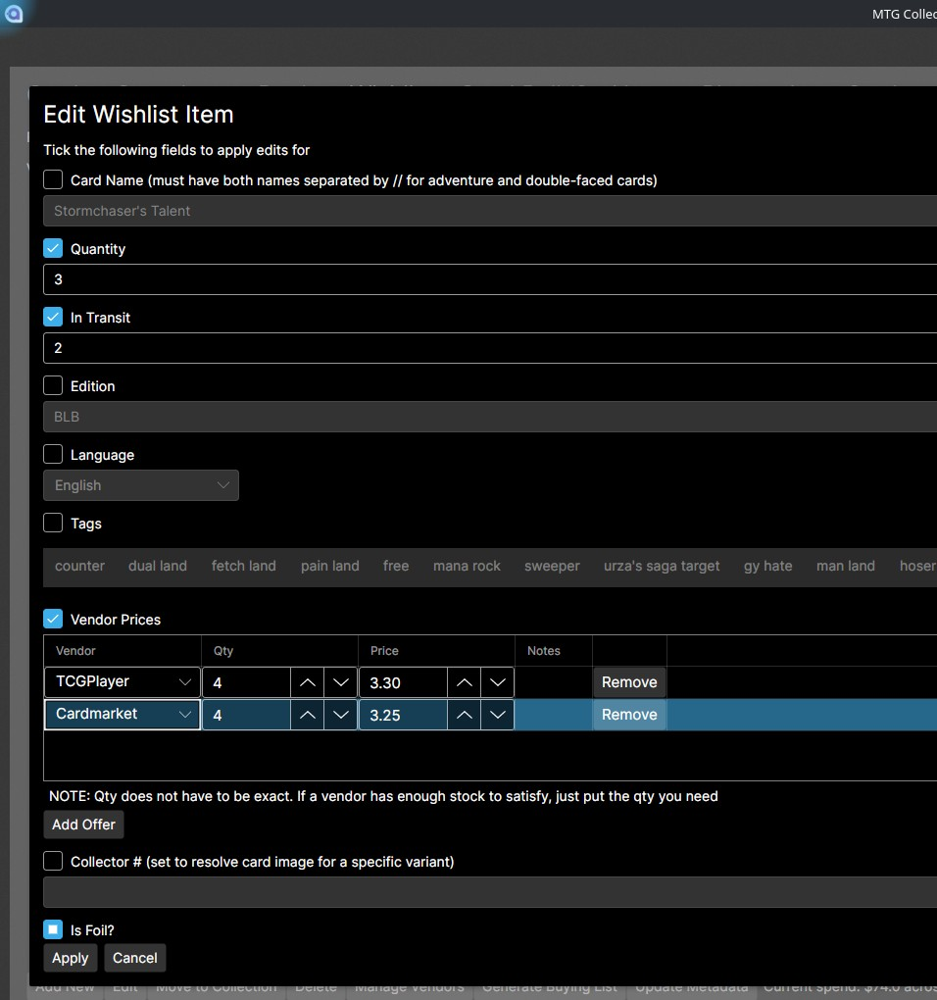

---

## Can I Build?

The **Can I Build?** tab checks whether your collection contains the cards needed to build a decklist. Paste a decklist into the text box (or **Import** a `.txt` file), then click **Check**.

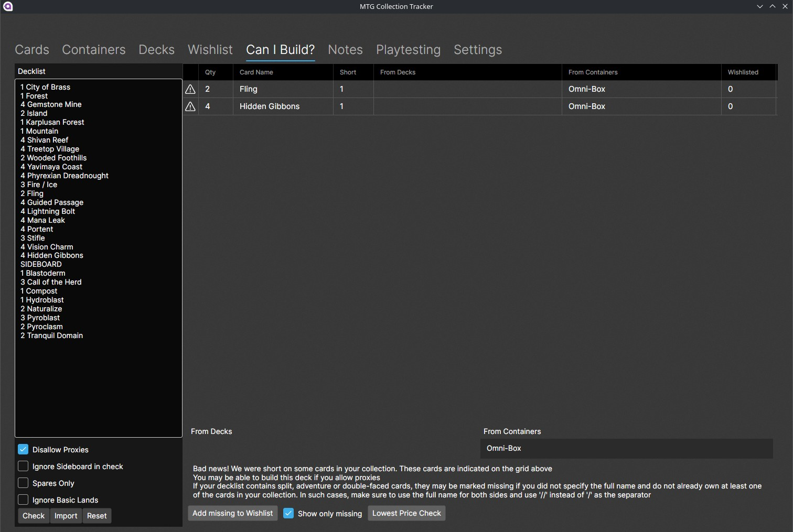

Options you can toggle before checking:

- **No proxies** — don't count proxy copies as available
- **Ignore sideboard** — skip sideboard lines in the decklist
- **Spares only** — only count cards not already used by another deck
- **Ignore basic lands** — exclude basic lands from the check

The result grid shows each card, the number requested, the shortfall, and which decks/containers already hold copies of it. From the results you can:

- **Add shortfall to wishlist** — one click turns the missing cards into wishlist items
- **Lowest Price Check** — get the cheapest price for each card in the list

> **TIP:** For split, adventure and double-faced cards, use the full name of both sides and separate them with `//` (not `/`) so the check can match them correctly.

---

## Notes

The Notes tab is a simple free-form notes area. Create a note, give it a title, write some text, and **Save**. Notes are stored in your collection database.

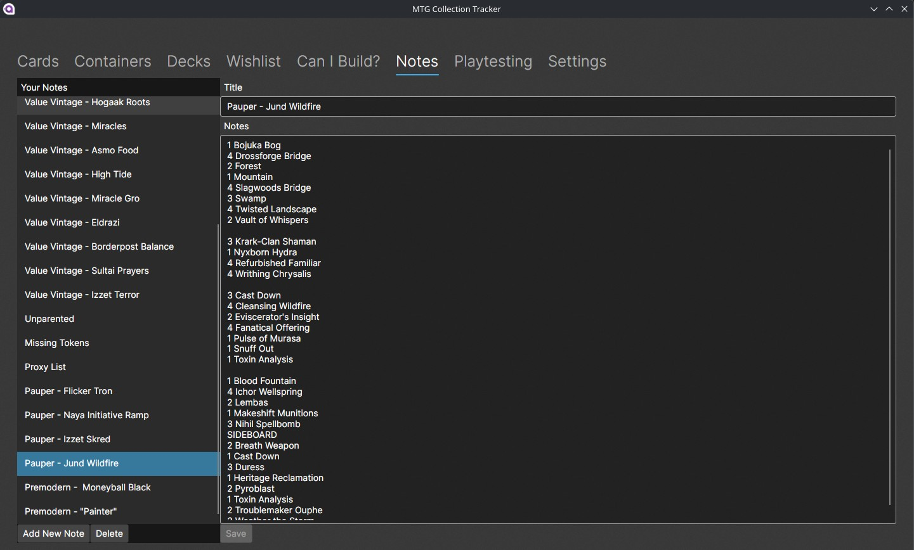

## Playtesting

The Playtesting tab lets you play out a game with one of your decks without needing the physical cards.

1. Pick a deck from the list (or use the search box to filter).
2. Click **Begin**.

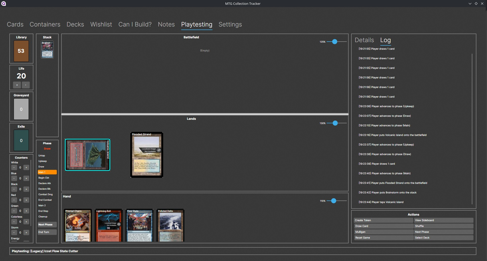

### During a game

The playtest view gives you:

- **Zones** — Library, Hand, Battlefield (lands and non-lands), Graveyard, Exile, Stack, Command Zone and Sideboard. Click a zone (e.g. the library) to view its contents and move cards around.
- **Counters** — life total, mana of each colour, storm, energy, poison, commander tax and commander damage.
- **Turn/phase tracking** — click through Untap → Upkeep → Draw → Main → Combat → Main → End, with **Next Phase** and **End Turn** buttons.
- **Card actions** — Draw Card, Shuffle, Mulligan, View Top X, Create Token, Command Zone, View Sideboard and Reset Game.

Card image sizes in playtesting can be adjusted via the persisted scale settings (see Settings below).

---

## Settings

The Settings tab has two parts:

### Tags

Tags are free-form labels you can attach to cards and wishlist items (for example `EDH`, `Modern`, `Trade`, `Foil`). Edit the list of tags (one per line) and click **Save Tags**. Changes are applied across your collection.

### Database Maintenance

| Action | Description |
|--------|-------------|
| **Update Missing Metadata** | Finds cards that have no Scryfall metadata and fetches it. |
| **Rebuild All Metadata** | Re-downloads metadata for every card. |
| **Normalize Card Names** | Cleans up card names so that different spellings match the same card. |
| **Import Card Identifiers** | Downloads the latest Scryfall card identifier mapping. **Run this whenever a new set is released** so you can add the new cards and start tracking their prices. |
| **Import Price Data** | Checks for and downloads the latest price data from MTGJSON. |

These operations can take a while and show a progress indicator while they run.

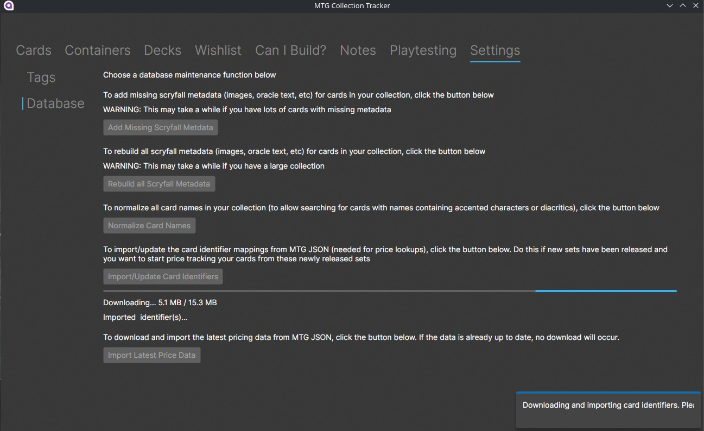

---

## Sharing your collection over the network

The app has a basic client/server model for sharing one collection database between devices:

1. On the machine that owns the collection, launch the app in **Server** mode (set an API key if you want to require authentication).
2. On another device on the same network, launch the app in **Remote Client** mode and enter the server's URL (e.g. `http://192.168.1.10:5757`) and API key.

The Remote Client instance forwards all operations to the server, and a status bar at the bottom of the window shows the connection state.

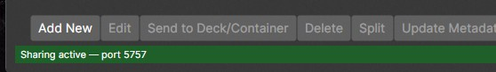
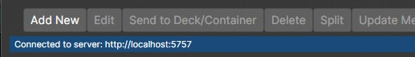

---

## Tips

- **Commit to using it.** The tracker is only as accurate as the habit of recording every card you add, move, trade or sell.
- **Update metadata** for newly added cards so that prices, card types and colours stay correct.
- **Import Card Identifiers when a new set comes out** (Settings → Database Maintenance). Until you do, the app won't know about the new cards or their prices.
- **Use containers and decks** to model where your cards physically are — this is what powers the "Can I Build?" spares-only check.
- **Back up `collection.sqlite`** regularly. It contains your entire collection.